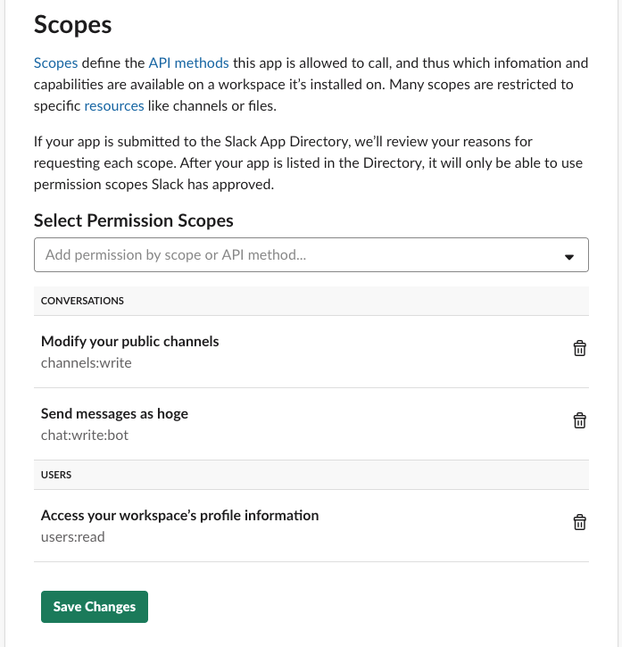
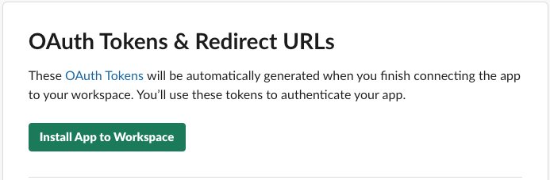

# emergency-slack
Inviting team member to slack channel.
This function helps incident management.


# Requirement
- Slack
- Google Cloud Functions

# How it works
1. type slash command
2. create Slack channel
3. post task list
4. invite team member

# Setup
## 1. create Slack App
https://api.slack.com/slack-apps
### add Permission Scopes
- `channels:write`
- `chat:write:bot`
- `users:read`


### install App to Workspace
you needs `OAuth Access Token`  

## 2. clone repository and install dependencies
```
$git clone git@github.com:ma-bo-do-fu/incident-management.git
$cd incident-management
$npm install
```
## 3. set up Service accounts credentials
c.f. https://serverless.com/framework/docs/providers/google/guide/credentials/
## 4. set up environment variables
```
$cd incident-management
$touch .env
```
update environment variables like `.env.example`.  
## 5. set config file
set `channel_name_prefix`,`tasks`,`members` to `config.yml`  
config.yml
```
channel_name_prefix: test

tasks:
  - task1
  - task2
  - task3

members:
  - user1
  - user2
  - user3

```
## 6. deploy function
```
$npm run deploy
```
## 7. add slash command
set the Cloud Functions Trriger as `Request URL`  
c.f. https://api.slack.com/slash-commands
# Usage
type slash command.  
example
```
/incident
```


